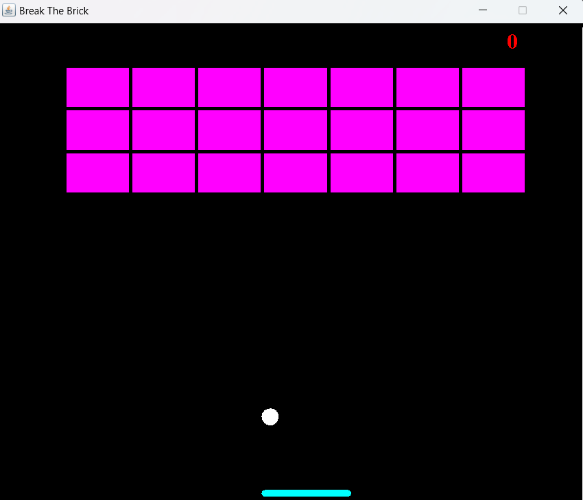

# JavaBrickBreakingGame
This is my first ever project that i have worked on.
It uses Java's GUI (Swings and awt) to create a brick breaking game.
# Brick Breaker Game

 <!-- Add a screenshot of your game here -->

## Table of Contents

- [About](#about)
- [Features](#features)
- [How to Play](#how-to-play)
- [Getting Started](#getting-started)
- [Contributing](#contributing)
- [License](#license)

## About

This is a simple implementation of the classic Brick Breaker game in Java using Swing. The objective of the game is to break all the bricks by bouncing a ball off a paddle.

## Features

- Classic Brick Breaker gameplay.
- Score tracking.
- Game over and win conditions.
- Paddle control using arrow keys.
- Restarting the game.

## How to Play

1. Use the **left** and **right** arrow keys to move the paddle.
2. Try to bounce the ball off the paddle and break all the bricks.
3. You win when you break all the bricks.
4. You lose if the ball falls below the paddle.

## Getting Started

### Prerequisites

- Java Development Kit (JDK)
- Integrated Development Environment (IDE) like Eclipse or IntelliJ IDEA (optional)

### Running the Game

1. Clone this repository:
git clone https://github.com/abhiboy23/JavaBrickBreakingGame.git
2. Navigate to the project directory:
cd brick-breaker
3. Compile and run the game:
javac brickBreaker/Main.java
java brickBreaker.Main
4. Use the **left**, **right** arrow keys to control the paddle.
5. Press **Enter** to start or restart the game.

## Contributing

If you'd like to contribute to this project, please follow these guidelines:

- Fork the repository.
- Create a new branch for your feature or bug fix: `git checkout -b feature-name`.
- Commit your changes with descriptive commit messages.
- Push your branch to your fork: `git push origin feature-name`.
- Create a pull request, explaining your changes and why they should be merged.

## License

This project is licensed under the [MIT License](LICENSE).

